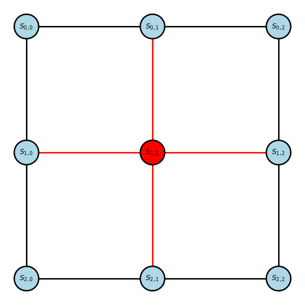
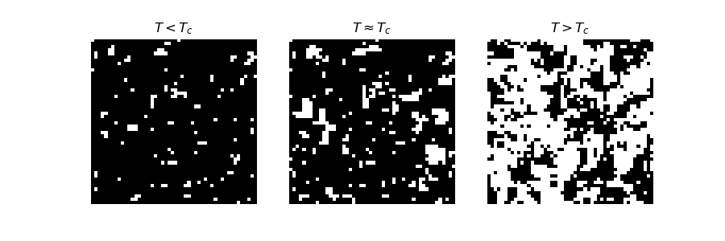
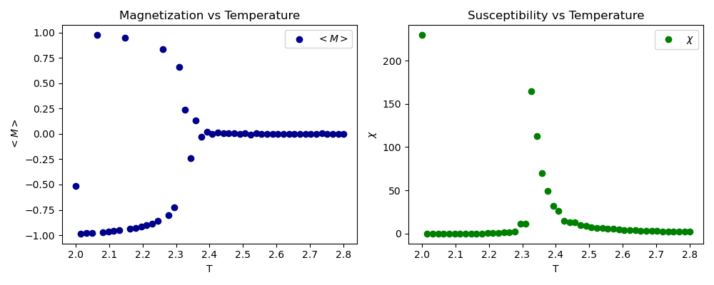
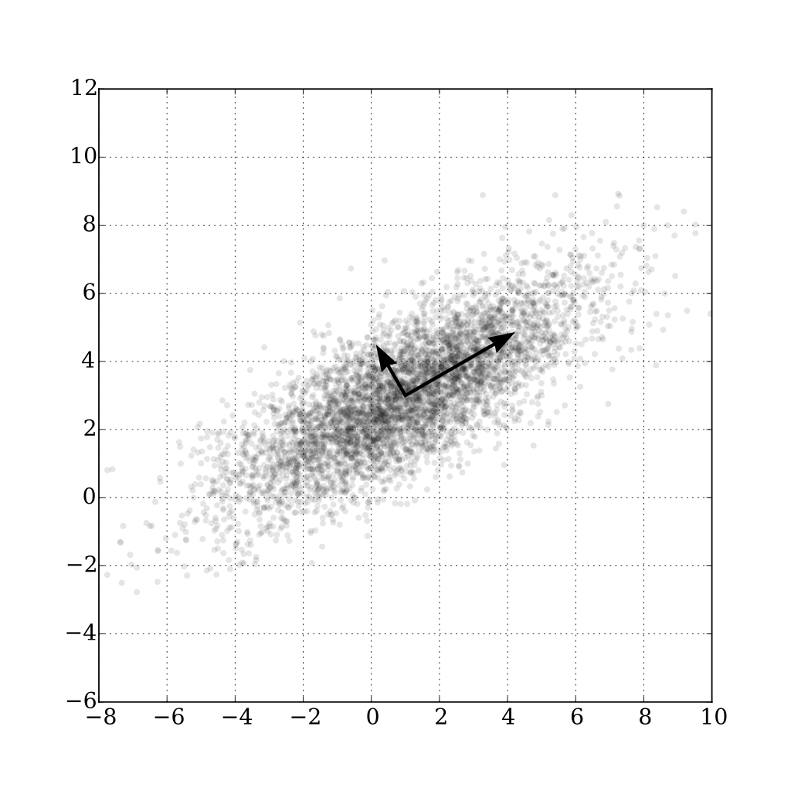
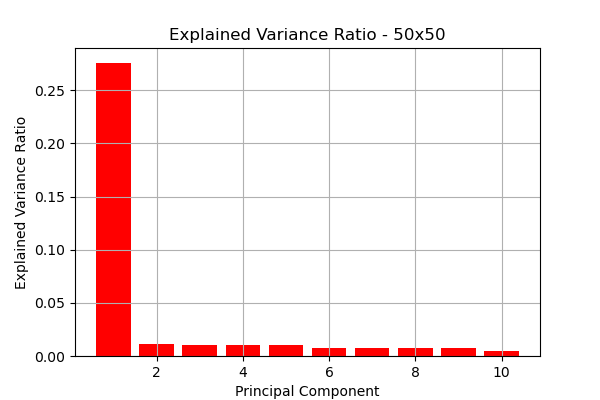
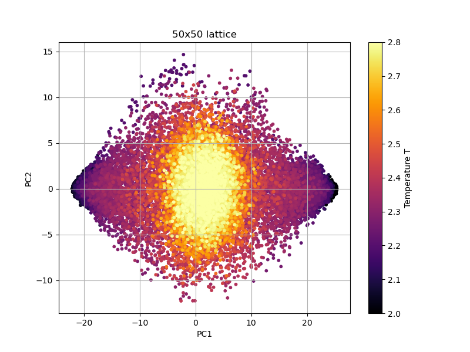
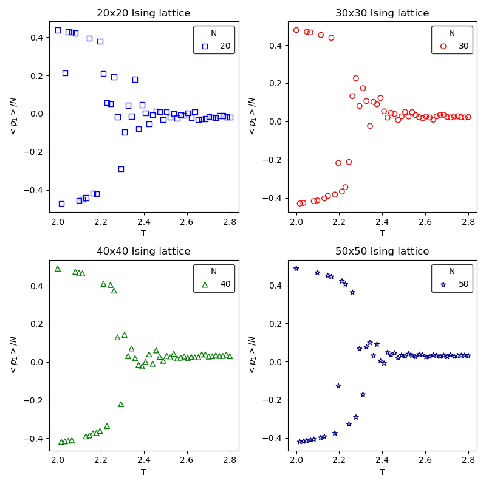
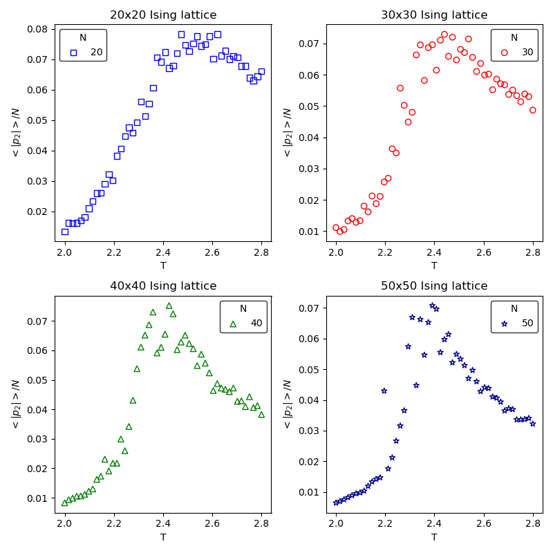
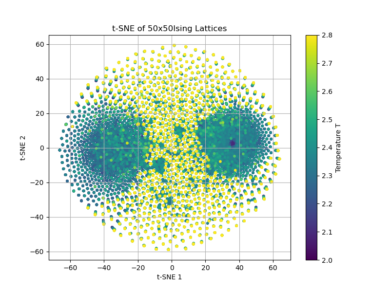
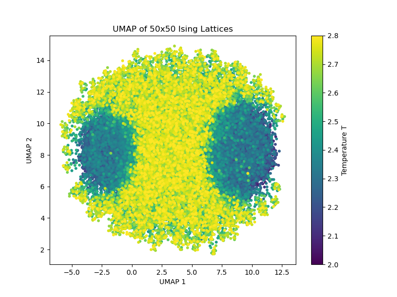

# Ising Model

# Table of Contents

- [Overview](#overview)
- [Getting Started](#getting-started)
- [Introduction](#introduction)
- [The 2D Ising Model](#the-2d-ising-model)
- [Hamiltonian of the System](#hamiltonian-of-the-system)
- [Observables](#observables)
  - [Magnetisation](#magnetisation)
  - [Susceptibility](#susceptibility)
- [Phase Transition](#phase-transition)
- [Sampling the Ising lattice at Equilibrium](#sampling-the-ising-lattice-at-equilibrium)
- [Numerical Results](#numerical-results)
- [Principal Component Analysis (PCA)](#principal-component-analysis-pca)
- [References](#references)


## Overview 

This code contains my code for studying the 2D Ising model using Principal Component Analysis (PCA). I got inspired by this paper [Hu et al.](https://arxiv.org/pdf/1704.00080)

## Getting Started

The code is fairly simple and self-explanatory. To use it, simply create a conda environment with the dependencies:

```bash
conda env create -f env.yaml
```

or , alternatively:
```bash
conda create --name ising_env python=3.11
conda activate ising_env
conda install --file requirements.txt
```

Using `venv`

```bash
python3 -m venv ising_env
source ising_env/bin/activate
pip install -r requirements.txt
```

The scripts to generate the data and plots are located in the [scripts](./scripts/) directory.

>[!NOTE] I used the *Wolff* algorithm from [this repository](https://github.com/fontclos/stat-mech-python-course/blob/master/code/ising_sethna.py).

## Introduction 

The 2D Ising lattice is the simplest model that undergoes a phase transition. It goes from an ordered phase ($T < T_c$), where the spins are aligned, to a disordered phase ($T > T_c$), where the spins are uncorrelated. The order parameter of the system decreases continuously from a finite value to zero around the critical temperature $T_c$. Principal Component Analysis (PCA) can be used on spin configurations to identify the transition as it separates the ordered from the disordered phase. 

## The 2D Ising Model

The 2D Ising model is defined as a lattice configuration $\mathbf{S}$ with dimensions $N_x$ and $N_y$, in this code I considered a square lattice where both dimensions are equal to $N$. The Ising lattice contains $|\mathbf{S}| = N^2$ nodes that take binary values ($S_{i,j} \in \{-1, 1\}$). Each node is connected by an edge to its first neighbors, with periodic boundary conditions. 

$$ 
\mathbf{ne(S_{i,j})} \equiv \{S_{i-1, j}, S_{i+1, j}, S_{i, j-1}, S_{i, j+1}\}
$$

meaning that each node only interacts with its closest neighbors. 

<div align="center">
  
</div>

## Hamiltonian of the System 

To simplify the notation let us flatten the lattice and make it a 1D vector $\mathbf{S} \in \{-1, 1\}^{N^{2}}$ 

$$
\mathbf{S} = (S_1, S_2,\dots, S_{N^2}),  S_i \in \{-1, 1\}
$$

So $|\mathbf{S}| = N^2$.

The energy of the system is given by 

$$
\mathcal{H} = -J \sum_{\langle i, j \rangle} S_i S_j - H \sum_{i=1}^{N^2} S_i,
$$

$\langle i, j \rangle$ pairwise interaction between spin at site $i$ with spin at site $j$, $J$ is the coupling (interaction) strength, and $H$ is the external magnetic field. We will take $J=1$ and $H=0$, making the Hamiltonian,

$$
\mathcal{H} = - \sum_{\langle i, j \rangle} S_i S_j,
$$

The partition function of the system is 

$$
\mathcal{Z} = \sum_{\{s_{i} = \pm 1\}}e^{-\beta \mathcal{H}} 
$$

Where $\beta$ is the inverse temperature $\beta = \frac{1}{k_B T}$. We take $k_B=1$. All the statistics of the model at equilibrium could be derived from the partition function.

The probability of observing a configuration $\mathbf{S}$ at temperature $T$ is given by the Boltzmann distribution:

$$
P(\mathbf{S}) = \frac{e^{-\beta \mathcal{H}}}{\mathcal{Z}}
$$

Analytically, all thermodynamic observables of the model can be derived either directly from the Boltzmann distribution or from the partition function.

## Observables: 

In statistical physics events are inherently stochastic, when we want to compute a quantity of the system we are interested in the average of that observable.

$$
\langle \mathcal{O} \rangle = \sum\limits_{\mathbf{S}} \mathcal{O}(\mathbf{S}) P(\mathbf{S})
$$
Practically, we can't take the average over all possible states, what we do is to average over $N$ representative samples. 
$$
\langle \mathcal{O} \rangle = \frac{1}{N}\sum\limits_{i=1}^{N} \mathcal{O}(\mathbf{S}_i) 
$$
### Magnetisation 

The magnetisation of the Ising model $M$ quantifies the alignment of spins, say all the spins are up ($S_i=1, \forall i$) the net magnetisation will be $1$, meaning that the system is in a ferromagnetic (ordered) phase. Similarly for the spins being all down ($S_i=-1, \forall i$). The magnetisation is the net average of the system's spin.

$$
\langle M\rangle = \frac{1}{N^2} \sum\limits_{i=1}^{N^2}S_i 
$$

The magnetisation is the order parameter of the 2D Ising model. Where $\langle M\rangle = 0$ for $T > T_c$ during the disordered phase and $\langle M\rangle \neq 0$ for $T < T_c$ during the ordered phase. 

### Susceptibility

The magnetic susceptibility $\chi$ measures the response of the system to a small external magnetic field, or equivalently the fluctuations of magnetization at zero field:

$$
\chi = \frac{N^2}{T} \Big( \langle M^2 \rangle - \langle M \rangle^2 \Big)
$$

Here $N^2$ is the number of spins in the lattice. Near the critical temperature $T_c$, $\chi$ peaks, signaling the phase transition between ordered (ferromagnetic) and disordered (paramagnetic) phases.

## Phase Transition

Phase transitions are qualitative changes in the macroscopic behavior of a system that occur when a control parameter (like temperature, pressure, or magnetic field) is varied. In physical terms, a small change in a microscopic property or parameter can lead to a dramatic change in the system’s collective behavior.

## Sampling the Ising lattice at Equilibrium 

In order to sample Ising configurations at equilibrium, I used the *Wolff algorithm*. I ran the algorithm for $10^4$ sweeps to reach equilibrium, then collected samples every 13th sweep. Simulations were performed at 50 temperature values ranging from $2.00$ to $2.80$, for lattice sizes of $N \in \{20, 30, 40, 50\}$.  Resulting in $770$ samples per temperature. 

Below is a sample of configurations **below, at, and above the critical temperature**.

<div align="center">
  
  <p>Sample Ising lattice configurations (50 x 50), below, at, and above the critical temperature.</p>
</div>

## Numerical Results 

Using the sampled configurations, I computed and visualized both the **magnetization per spin** and the **susceptibility**. The numerical results clearly show a **phase transition**, where the system goes from an **ordered phase**, characterized by most spins being aligned up or down, to a **disordered phase**.  

The magnetization captures this behavior, as the degenerate ground states appear at low temperatures, while the susceptibility highlights the fluctuations near the transition. The observed critical temperature differs slightly from the theoretical value $T_c \approx 2.269$ due to **finite-size effects**.  

<div align="center">
  
</div>

## Principal Component Analysis (PCA)

Principal Component Analysis (PCA) is an **unsupervised learning technique** used for linear dimensionality reduction. The algorithm starts with a dataset of \(M\) unlabeled samples:

$$
\mathcal{D}=\{\mathbf{S}_i\}_{i=1}^{M}.
$$

In our case, each $\mathbf{S}_i$ is a sampled Ising configuration at equilibrium. We organize these samples into the so-called **design matrix**:

$$
\mathbf{X} = 
\begin{bmatrix}
\mathbf{S}_1 \\
\mathbf{S}_2 \\
\vdots \\
\mathbf{S}_M
\end{bmatrix},
$$

so that $\mathbf{X}$ has dimensions $M \times N^2$. Here, $M$ is the number of samples and $N^2$ is the number of features (spins).  

>**NOTE:** The features of the data are the spin sites. In the dataset each one of the $50$ temperature has $770$ samples of the configuration at equilibrium. The dataset has $50 \times 770 = 38500$ rows and $2500$ columns. 

Clearly, the data lives in a **high-dimensional space**. However, in many physical systems, the relevant structure is captured by a much smaller number of effective degrees of freedom. PCA seeks to find a **low-dimensional representation** of the data that preserves as much of the original variance as possible.  

This can be framed in two equivalent ways:  
- Find the linear projections that **maximize the variance** of the data.  
- Find the linear projections that **minimize the reconstruction error**.  

Both viewpoints lead naturally to PCA (see [Bishop, *Pattern Recognition and Machine Learning*](https://www.microsoft.com/en-us/research/wp-content/uploads/2006/01/Bishop-Pattern-Recognition-and-Machine-Learning-2006.pdf) for a detailed derivation).  

Formally, PCA identifies the eigenvectors of the data covariance matrix \(\boldsymbol{\Sigma}\):

$$
\boldsymbol{\Sigma} = \frac{1}{M-1}\,\mathbf{X}^T \mathbf{X}, 
\quad
\boldsymbol{\Sigma}\,\mathbf{v}_i = \lambda_i \mathbf{v}_i,
$$

where \(\lambda_i\) are the eigenvalues and \(\mathbf{v}_i\) the eigenvectors. The eigenvalues are ordered \(\lambda_1 \geq \lambda_2 \geq \dots\), so the **first principal component** corresponds to the direction of maximum variance, the second to the next-largest variance, and so on.  

<div align="center">
  
  <p><em>By Nicoguaro - Own work, CC BY 4.0, 
  <a href="https://commons.wikimedia.org/w/index.php?curid=46871195">link</a></em></p>
</div>

> **Note:** Earlier we flattened the Ising lattice into a 1D vector, so each configuration \(\mathbf{S}_i\) can be treated directly as a feature vector in this analysis.  

Visualizing the explained variance ratio of the Ising dataset versus the component index using $10$ principal components:

<div align="center">
  
</div>

We notice that most of the variance in the data is captured by the first principal component. Therefore, I will be using only the first two components.


Below is the result of applying PCA to the Ising model with lattice size \(50 \times 50\):

<div align="center">
  
</div>

PCA successfully identifies the **phase structure** of the system. At **low temperatures** (\(T < T_c\)), two distinct clusters emerge, corresponding to the **degenerate ground states** (all spins up vs. all spins down). At **high temperatures** (\(T > T_c\)), the system enters the disordered phase, and configurations cluster around the center of the plot. Near the **critical temperature** (\(T \approx T_c\)), fluctuations are enhanced and the transition between ordered and disordered phases becomes visible in the PCA projection.

When visualizing the **average of the first principal component** across lattice sizes \(N\) vs temperature $T$, we obtain the following figure:

<div align="center">
  
</div>

This shows that the **first principal component** behaves analogously to the **magnetization** \(\langle M \rangle\) of the Ising model. In other words, PCA automatically extracts the order parameter of the system, separating the ordered and disordered phases without prior knowledge of the physics. 

Now, visualizing the **second principal component**, we observe that it behaves similarly to the **susceptibility**:

<div align="center">
  
</div>

This indicates that PCA not only identifies the order parameter (magnetization) through the first component, but also captures the fluctuations near the critical temperature through the second component.


## Interesting Extensions

I performed a similar analysis on the data using non-linear dimensionality reduction techniques, namely t-SNE and UMAP. The resulting visualizations show that the phase transition is also captured. 

<div align="center">
  
  
</div>

Since these techniques capture both local and global structure, the circular shape of the figures may indicate that the algorithms captured the symmetry of the system.


## References
- Chapter 19 on Statistical mechanics [Lectures on probability, information and large scale behaviour](https://library.oapen.org/handle/20.500.12657/103990) 
- Very nice blog [Ising models and Metropolis algorithm](https://dpotoyan.github.io/Statmech4ChemBio/4_ising/02_MCMC.html)
- Cool notebook on the Ising model [Introduction to Statistical Mechanics in Python 3](https://github.com/fontclos/stat-mech-python-course/blob/master/notebooks/4-Ising-Model.ipynb)
- Original paper that used PCA on Ising model [Discovering Phases, Phase Transitions and Crossovers through Unsupervised Machine Learning](https://arxiv.org/pdf/1704.00080)
- Very nice book for machine learning [Bishop, *Pattern Recognition and Machine Learning*](https://www.microsoft.com/en-us/research/wp-content/uploads/2006/01/Bishop-Pattern-Recognition-and-Machine-Learning-2006.pdf) 
- Great paper for physicists [A high-bias, low-variance introduction to Machine Learning for physicists](https://arxiv.org/pdf/1803.08823).  
